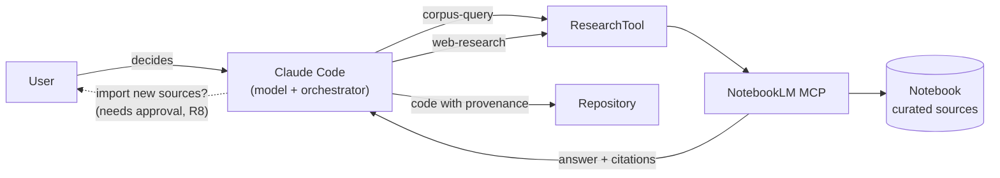

# claudebooklm-research

**Grounded research for AI coding agents: Claude Code + Google NotebookLM over MCP, with traceable sources and a human in the loop.**

[Leer en castellano](README.es.md)

[](https://github.com/gasleo/claudebooklm-research/actions/workflows/ci.yml)

An AI agent that writes code will happily fill a gap with a plausible number. In most software that is a style problem; in a physics simulator, a pricing model or anything someone has to defend, it is a correctness problem. This repository specifies an architecture and implements its research layer: an agent answers from a **curated corpus** (a NotebookLM notebook), **cites** what it found, **says so** when the corpus does not have it, and **asks before** changing the corpus.



## What's here

| Folder | What it is |
|---|---|
| [`src/notebooklm_research/`](src/notebooklm_research/tool.py) | `ResearchTool`, the spec's research layer in Python: `query`, `discover` and a confirmation-gated `import_sources` over an MCP client, plus the `nlm-research` CLI. |
| [`tests/`](tests/) | Unit tests on a scripted backend, protocol tests against an in-memory MCP server, and opt-in contract tests against the real `notebooklm-mcp`. |
| [`spec/`](spec/architecture.md) | The architecture (v0.2): decision chat → orchestrator → agents → research tool, eight rules, task/result contracts and Mermaid diagrams. |
| [`kit/`](kit/README.md) | A `CLAUDE.md` block and a `/research` skill that make Claude Code follow the same rules interactively. |
| [`case-study/`](case-study/galpon.md) | How it was used in a process-plant simulator, where every physical constant carries its source and a firmness label. |

## ResearchTool

```python
from notebooklm_research import ResearchTool, connect

async def ask_user(discovery) -> bool:          # the human in the loop (R8)
    ...

async with connect() as backend:                 # spawns notebooklm-mcp over stdio
    tool = ResearchTool(backend, confirm_import=ask_user)

    answer = await tool.query("Why does the reactor settle at 260 °C?", "my-notebook")
    answer.status        # completed | partial (answer without citations) | failed
    answer.sources       # Source(reference, cited_text, citation_number), never invented

    found = await tool.discover("pasta water uptake kinetics", "my-notebook")
    await tool.import_sources(found)             # asks ask_user first; declined = nothing sent
```

Design decisions, each pinned by tests:

- **R8 is structural.** `confirm_import` is a required constructor argument: there is no way to build a tool that imports without asking. A declined import never reaches the backend.
- **Failures are results, not exceptions.** Backend errors, expired tasks and timeouts come back as `failed` results with the server's error code, so one failed task doesn't abort an agent's run (spec §10). Programming errors still raise.
- **Retries follow the server's contract.** One retry when notebooklm-mcp marks an error `retriable` (and not `unconfirmed`), or when a task expired; never more.
- **Uncited is not grounded.** An answer with no citations is `partial`, not `completed`.
- **Polling is injectable.** Sleep and clock are parameters, so the tests run the whole async polling cycle in milliseconds on a virtual clock.
- **One port, many backends.** `ResearchTool` depends on a one-method `ResearchBackend` protocol; `McpBackend` is one implementation of it.

Command line:

```bash
uv run nlm-research query "my-notebook" "Why does a fed jacketed reactor settle below its jacket temperature?"
```

```bash
uv run nlm-research discover "my-notebook" "pasta cooking kinetics" --import
```

### Verification

| Check | Result |
|---|---|
| `uv run pytest --cov` | 48 tests, 98 % branch coverage (CI fails under 90 %) |
| `uv run mypy` (strict, src and tests) · `ruff check` · `ruff format --check` | clean |
| `uv run pytest -m live` against notebooklm-mcp 0.8.3 | every argument sent is accepted by the real tool schemas; real errors parse into code and `retriable` |
| `nlm-research query` against a 45-source notebook | `completed`, 6 citations with source id, number and cited passage, plus a conversation id for follow-ups |

The live run also found a bug the unit tests had missed: answers containing `ρ` crashed the CLI on a Windows cp1252 console. It is fixed, with a regression test, and CI runs on Windows for that reason.

## The ideas that matter

**Two operations, two decisions.** Asking the existing corpus (`chat`) and finding new sources (`research`) are different moves. The agent picks one per step and never blends them.

**Traceability (R7).** Every finding points to a citation returned by NotebookLM (`source_id`, `cited_text`, `citation_number`). If the tool doesn't return a field, the agent omits it rather than inventing it.

**"Not in the sources" is a valid answer.** The agent separates what the corpus says from what it adds from general knowledge, and labels the latter.

**The corpus changes only with approval (R8).** Importing sources modifies the user's notebook, so it is never an automatic continuation of a search.

**Provenance ends up in the code.** A researched constant names its source in its docstring; a chosen one says it was chosen. In the case study this goes further: each value carries a label — *firm, partial, model decision, no source, unverified* — stored with the data.

## Quick start

Requires [Claude Code](https://claude.com/claude-code), [uv](https://docs.astral.sh/uv/) and a Google account with NotebookLM.

```bash
uv tool install "notebooklm-py[mcp,browser,cookies]"
```

```bash
notebooklm login
```

```bash
claude mcp add --scope user notebooklm -- notebooklm-mcp
```

For the Python library and CLI, from a clone of this repository:

```bash
uv sync
```

For interactive use inside Claude Code, copy [`kit/CLAUDE.md`](kit/CLAUDE.md) into your project's `CLAUDE.md` and the [`/research`](kit/skills/research/SKILL.md) skill into `.claude/skills/`. Details in [kit/README.md](kit/README.md).

## What is built and what is specified

| Part of the spec | State |
|---|---|
| `ResearchTool` (query / discover / confirmed import), `TaskResult` and `Source` contracts, R7, R8, async polling, retry and timeout handling | **Built and tested** — `src/`, `tests/` |
| Research Agent rules for an interactive agent | **In use** — `kit/`, used on the case study project |
| Decision chat, orchestrator pipeline (planner, dispatcher, agent manager, aggregator), parallel agents | **Specified only** — `spec/` |

The orchestrator is the natural next step: `ResearchTool` already returns the structured, failure-tolerant results the spec's aggregator expects.

## Credits

The MCP server is [notebooklm-py](https://github.com/teng-lin/notebooklm-py) by Teng Lin (MIT). It drives NotebookLM through its web session, not an official Google API; this repository is a client of it and neither includes nor modifies it.

## License

[MIT](LICENSE) © 2026 Gastón Villalba
