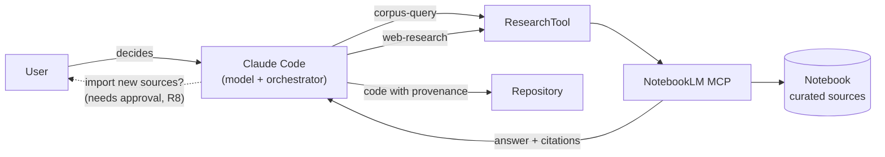

# claude-notebooklm-research

**Grounded research for AI coding agents: Claude Code + Google NotebookLM over MCP, with traceable sources and a human in the loop.**

[Leer en castellano](README.es.md)

An AI agent that writes code will happily fill a gap with a plausible number. In most software that is a style problem; in a physics simulator, a pricing model or anything someone has to defend, it is a correctness problem. This repository describes an architecture — and ships a working kit — where the agent answers from a **curated corpus** (a NotebookLM notebook), **cites** what it found, **says so** when the corpus does not have it, and **asks before** changing the corpus.



## What's here

| Folder | What it is |
|---|---|
| [`spec/`](spec/architecture.md) | The architecture (v0.2): decision chat → orchestrator → agents → research tool, eight rules, task/result contracts and Mermaid diagrams. |
| [`kit/`](kit/README.md) | What runs today: a `CLAUDE.md` block and a `/research` skill that make Claude Code follow the spec against a NotebookLM notebook. |
| [`case-study/`](case-study/galpon.md) | How it was used in a process-plant simulator, where every physical constant carries its source and a firmness label. |

## The ideas that matter

**Two operations, two decisions.** Asking the existing corpus (`chat`) and finding new sources (`research`) are different moves. The agent picks one per step and never blends them.

**Traceability (R7).** Every finding points to a citation returned by NotebookLM (`source_id`, `cited_text`, `citation_number`). If the tool doesn't return a field, the agent omits it rather than inventing it.

**"Not in the sources" is a valid answer.** The agent separates what the corpus says from what it adds from general knowledge, and labels the latter.

**The corpus changes only with approval (R8).** Importing sources modifies the user's notebook, so it is never an automatic continuation of a search.

**Provenance ends up in the code.** A researched constant names its source in its docstring; a chosen one says it was chosen. In the case study this goes further: each value carries a label — *firm, partial, model decision, no source, unverified* — stored with the data.

## Quick start

Requires [Claude Code](https://claude.com/claude-code), [uv](https://docs.astral.sh/uv/) and a Google account with NotebookLM.

```bash
uv tool install "notebooklm-py[mcp,browser,cookies]"
```

```bash
notebooklm login
```

```bash
claude mcp add --scope user notebooklm -- notebooklm-mcp
```

Then copy [`kit/CLAUDE.md`](kit/CLAUDE.md) into your project's `CLAUDE.md` and the [`/research`](kit/skills/research/SKILL.md) skill into `.claude/skills/`. Details in [kit/README.md](kit/README.md).

## Spec vs. practice

The spec describes a multi-agent system: a separate decision chat, a dispatcher, research/analysis/verification agents running in parallel. What runs today is its single-agent form — Claude Code as main model, orchestrator and research agent at once. The rules that carry the value (R7 traceability, R8 confirmation, explicit unknowns) apply unchanged, and the `ResearchTool` boundary is where a fuller implementation would plug in.

## Credits

The MCP server is [notebooklm-py](https://github.com/teng-lin/notebooklm-py) by Teng Lin (MIT). It drives NotebookLM through its web session, not an official Google API; this repository neither includes nor modifies it.

## License

[MIT](LICENSE) © 2026 Gastón Villalba
